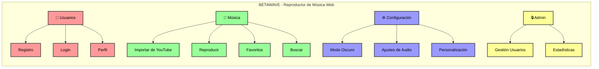

```mermaid
graph TB
    subgraph "BETAWAVE - Reproductor de Música Web"
        direction TB
        
        U[👤 Usuarios]
        M[🎵 Música]
        C[⚙️ Configuración]
        A[🔒 Admin]
        
        U --> U1[Registro]
        U --> U2[Login]
        U --> U3[Perfil]
        
        M --> M1[Importar de YouTube]
        M --> M2[Reproducir]
        M --> M3[Favoritos]
        M --> M4[Buscar]
        
        C --> C1[Modo Oscuro]
        C --> C2[Ajustes de Audio]
        C --> C3[Personalización]
        
        A --> A1[Gestión Usuarios]
        A --> A2[Estadísticas]

        classDef users fill:#FF9999,stroke:#333,stroke-width:2px,color:#000
        classDef music fill:#99FF99,stroke:#333,stroke-width:2px,color:#000
        classDef config fill:#9999FF,stroke:#333,stroke-width:2px,color:#000
        classDef admin fill:#FFFF99,stroke:#333,stroke-width:2px,color:#000
        classDef feature fill:#ffffff,stroke:#333,stroke-width:1px,color:#000

        class U,U1,U2,U3 users
        class M,M1,M2,M3,M4 music
        class C,C1,C2,C3 config
        class A,A1,A2 admin
    end
```
