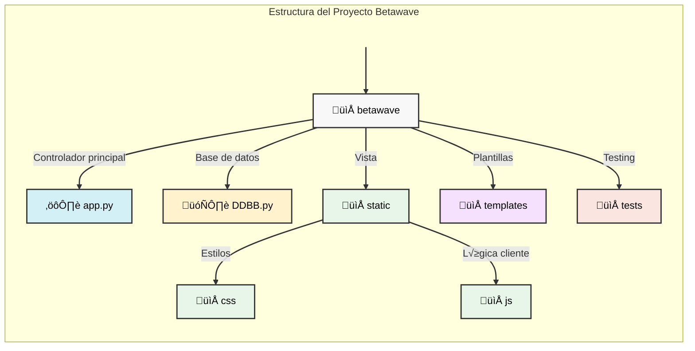

```mermaid
graph TB
    subgraph "Estructura del Proyecto Betawave"
        direction TB
        
        %% Añadiendo espacio en blanco arriba
        space1[" "]
        space1 --> A
        
        %% Nodo principal
        A[📁 betawave]
        A -->|"Controlador principal"| B[⚙️ app.py]
        A -->|"Base de datos"| C[🗄️ DDBB.py]
        
        A -->|"Vista"| D[📁 static]
        D -->|"Estilos"| E[📁 css]
        D -->|"Lógica cliente"| F[📁 js]
        
        A -->|"Plantillas"| G[📁 templates]
        A -->|"Testing"| H[📁 tests]

        %% Estilos de los nodos
        style space1 fill:none,stroke:none
        style A fill:#f8f8f8,stroke:#333,stroke-width:2px,color:#000
        style B fill:#d4f0f7,stroke:#333,stroke-width:2px,color:#000
        style C fill:#fff2cc,stroke:#333,stroke-width:2px,color:#000
        style D fill:#e8f5e9,stroke:#333,stroke-width:2px,color:#000
        style E fill:#e8f5e9,stroke:#333,stroke-width:2px,color:#000
        style F fill:#e8f5e9,stroke:#333,stroke-width:2px,color:#000
        style G fill:#f5e1fd,stroke:#333,stroke-width:2px,color:#000
        style H fill:#fbe5e1,stroke:#333,stroke-width:2px,color:#000
    end

    %% Estilos globales
    classDef default fill:#f9f9f9,stroke:#333,stroke-width:2px
    linkStyle default stroke:#333,stroke-width:2px
```
